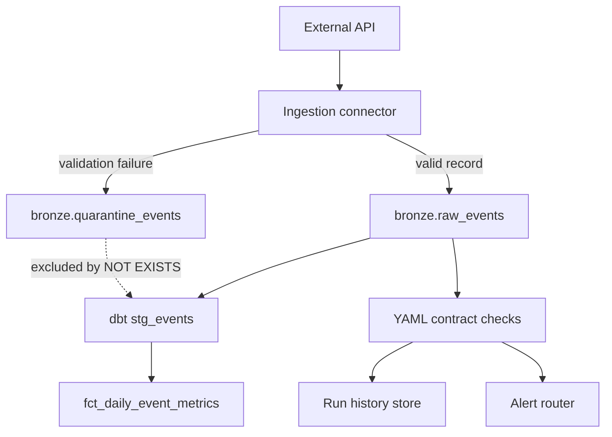

Production pipelines fail in two ways: loudly at 3 a.m., or quietly in the CEO's dashboard. **Data quality contracts** give you a third path — catch drift at the boundary, persist evidence, and route bad rows before they poison silver models.

> **Portfolio:** [br413.github.io](https://br413.github.io/) · **Quality layer:** [data-quality-observability](https://github.com/br413/data-quality-observability) · **Ingestion quarantine:** [production-data-pipeline v0.2.1](https://github.com/br413/production-data-pipeline/releases/tag/v0.2.1)

## The problem: silent failure modes

Most teams discover data quality problems **downstream**:

- Schema drift lands in bronze; dbt tests fail hours later (or worse, pass on stale assumptions)
- One poison-pill API record aborts an entire ingestion page — valid events in the same batch never land
- Operators grep logs instead of querying failure artifacts

The fix is not "more dbt tests." It is **layered gates** with durable evidence at each boundary.

## What a contract is (and isn't)

A **data contract** is a machine-readable agreement about a dataset: column types, null rules, freshness windows, and referential integrity. It is a **gate at the dataset boundary**, not a replacement for warehouse-level tests.

Example from my [data-quality-observability](https://github.com/br413/data-quality-observability) project:

```yaml
name: orders
version: "1.0"
description: Order facts contract for retail analytics

freshness:
  column: updated_at
  max_age_hours: 48

columns:
  order_id:
    type: string
    nullable: false
    unique: true
  customer_id:
    type: string
    nullable: false
  order_total:
    type: number
    nullable: false
  status:
    type: string
    nullable: false
  updated_at:
    type: datetime
    nullable: false

referential_integrity:
  - column: customer_id
    references:
      table: customers
      column: customer_id
```

Run the contract against sample data:

```bash
python -m src.dqo.cli run \
  --contract contracts/orders.yml \
  --data data/samples/orders.csv \
  --references data/samples
```

The CLI validates schema, nulls, uniqueness, freshness, and foreign keys — then persists run history and routes alerts.

**What contracts are not:** they do not replace dbt source freshness or uniqueness tests. They complement them by running **before promote** with auditable run history.

## Two layers in a real stack

Production quality work spans two boundaries in my portfolio:

| Layer | When | Project |
|-------|------|---------|
| **Row-level quarantine** | During ingestion | [production-data-pipeline](https://github.com/br413/production-data-pipeline) — invalid events → `bronze.quarantine_events` |
| **Dataset contracts** | After landing / before promote | [data-quality-observability](https://github.com/br413/data-quality-observability) — run history + alerts |



### Row-level quarantine at ingestion

Before v0.2.1, my pipeline used **fail-fast batch validation**: one bad record aborted the entire page. [ADR 0004](https://github.com/br413/production-data-pipeline/blob/main/docs/adr/0004-failed-record-quarantine.md) introduces per-record routing:

- **Pass** → land in `bronze.raw_events`
- **Fail (recoverable)** → write to `bronze.quarantine_events` with rule name, message, and raw payload
- **Checkpoint** → quarantined `event_id` values are marked processed so poison pills do not block retries

Enable quarantine during ingestion:

```bash
python -m src.pipeline.ingestion \
  --source sample \
  --storage postgres \
  --pipeline-name sample-ingestion \
  --enable-quarantine \
  --alert-on-quarantine
```

The quarantine table schema:

```sql
CREATE TABLE IF NOT EXISTS bronze.quarantine_events (
    event_id TEXT NOT NULL,
    occurred_at TIMESTAMPTZ,
    payload JSONB NOT NULL,
    failed_rule TEXT NOT NULL,
    failure_message TEXT NOT NULL,
    pipeline_name TEXT NOT NULL,
    run_id TEXT NOT NULL,
    quarantined_at TIMESTAMPTZ NOT NULL DEFAULT NOW(),
    PRIMARY KEY (pipeline_name, event_id, run_id)
);
```

Silver models exclude quarantined IDs explicitly:

```sql
select
    event_id,
    occurred_at,
    (payload ->> 'value')::numeric as event_value,
    ingested_at
from {{ source('bronze', 'raw_events') }} as r
where r.payload ? 'value'
  and not exists (
    select 1
    from {{ source('bronze', 'quarantine_events') }} as q
    where q.event_id = r.event_id
  )
```

**Operator triage** becomes a SQL query instead of a log grep:

```sql
SELECT event_id, failed_rule, failure_message, quarantined_at
FROM bronze.quarantine_events
WHERE pipeline_name = 'sample-ingestion'
ORDER BY quarantined_at DESC
LIMIT 20;
```

The ingestion summary now includes `records_quarantined` alongside fetched, inserted, and skipped counts.

### Dataset contracts after landing

The quality observability layer runs **after** data lands but **before** you trust it for analytics:

```text
Data contract (YAML)
    ↓
Quality check suite (schema · null · unique · freshness · RI)
    ↓
Run summary → history store (SQLite / PostgreSQL)
    ↓
Alert router (console · JSONL file · webhook)
```

Schedule it with the included Airflow DAG (`dqo_contract_checks`) or run ad hoc from CI.

## Alert routing that on-call will answer

Alerts must be **actionable**. Both projects route to console, file, and webhook channels:

| Event | Source | When |
|-------|--------|------|
| `zero_record_ingestion` | production-data-pipeline | Ingestion succeeded but landed zero new records |
| `ingestion_quarantine` | production-data-pipeline | One or more records routed to quarantine |
| Contract failure | data-quality-observability | Schema, freshness, or RI check failed |

Webhook payloads include structured summaries — pipeline name, quarantine count, failed rule — so on-call can triage without opening the repo.

Tie alerts to **operations runbooks**: query the quarantine table, inspect the failed payload, fix the source or rule, then replay or manually promote the row.

## CI as contract enforcement

Green CI means the **contract suite ran**, not that production data is clean:

- **production-data-pipeline** — pytest covers quarantine routing, webhook event types, and dbt integration (including quarantine exclusion in `stg_events`)
- **data-quality-observability** — pytest covers check logic; integration tests mock webhook delivery success and failure

GitHub Actions runs both suites on every push. Contract YAML changes trigger the same gates as code changes — drift in the contract file is caught before merge.

## Practical adoption path

You do not need a dedicated data quality platform team to start:

1. **Pick one high-value dataset** — orders, events, or your most-used fact table
2. **Add freshness + required-field checks** before adding referential integrity complexity
3. **Enable quarantine/DLQ** when API sources are messy or batch fail-fast is blocking valid records
4. **Wire alerts** to your existing webhook or Slack path — reuse the same router for ingestion and contract failures
5. **Document recovery** in an operations runbook so 2 AM triage does not depend on tribal knowledge

## How this connects to article #1

My first Dev.to article covered [incremental ingestion, checkpoints, and medallion layering with dbt](https://dev.to/bobby_ray_581732c715283b2/building-a-production-data-pipeline-with-incremental-loading-and-dbt-2e2c). That pipeline intentionally ended with "at scale I would add a dead-letter queue and a separate quality layer."

This article is the follow-through: **quarantine at ingestion** (v0.2.1) and **contracts at the quality boundary** (data-quality-observability), wired together as a production-style stack.

## Try it yourself

**Quality contracts:**

```bash
git clone https://github.com/br413/data-quality-observability.git
cd data-quality-observability
python -m venv .venv
# Windows: .\.venv\Scripts\Activate.ps1
pip install -r requirements.txt
pytest
python -m src.dqo.cli run --contract contracts/orders.yml --data data/samples/orders.csv --references data/samples
```

**Ingestion quarantine:**

```bash
git clone https://github.com/br413/production-data-pipeline.git
cd production-data-pipeline
pip install -r requirements.txt
docker compose up -d
python -m src.pipeline.ingestion \
  --source sample --storage postgres --pipeline-name sample-ingestion \
  --enable-quarantine --alert-on-quarantine
python -m src.pipeline.run_dbt --target dev
```

Both repos include ADRs, operations runbooks, and CI with PostgreSQL service containers.

## Summary

Data quality is a **stack of boundaries**, not a single tool. Row-level quarantine keeps poison pills from blocking valid ingestion. Dataset contracts catch drift before promote. Persisted failure artifacts and webhook alerts turn silent dashboard bugs into triageable incidents.

---

**Related projects**

- [production-data-pipeline v0.2.1](https://github.com/br413/production-data-pipeline/releases/tag/v0.2.1) — quarantine/DLQ at ingestion
- [data-quality-observability](https://github.com/br413/data-quality-observability) — YAML contracts and run history
- [cloud-lakehouse-blueprint](https://github.com/br413/cloud-lakehouse-blueprint) — platform governance and lineage
- [Portfolio site](https://br413.github.io/) · [GitHub](https://github.com/br413)

If this helped, **star the repos** or leave a comment — I am interested in how other teams layer contracts and quarantine in production.
